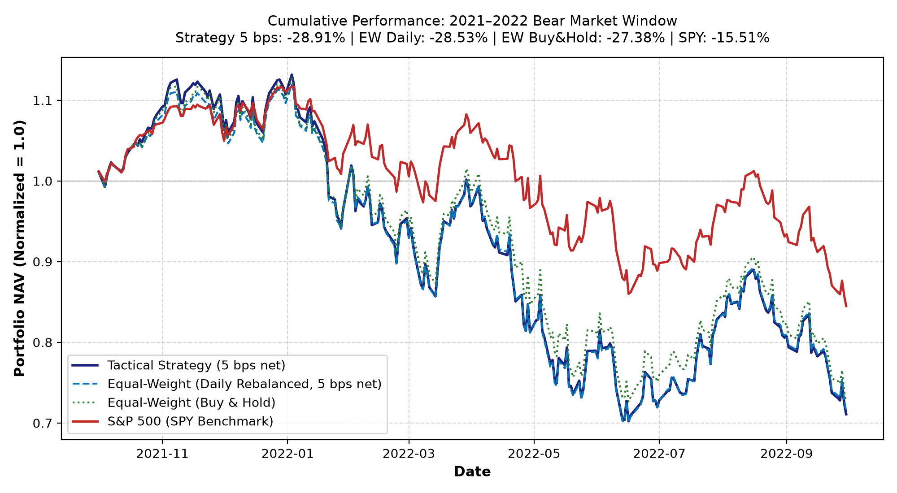
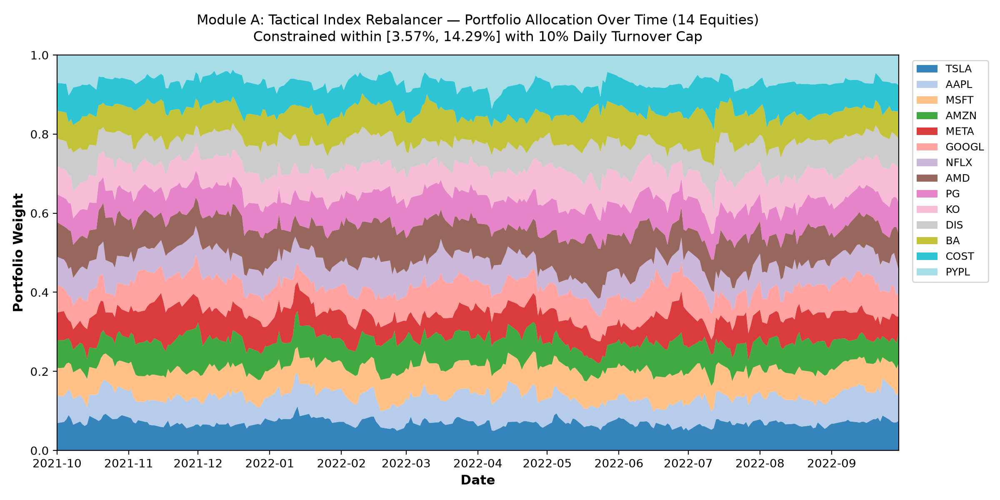
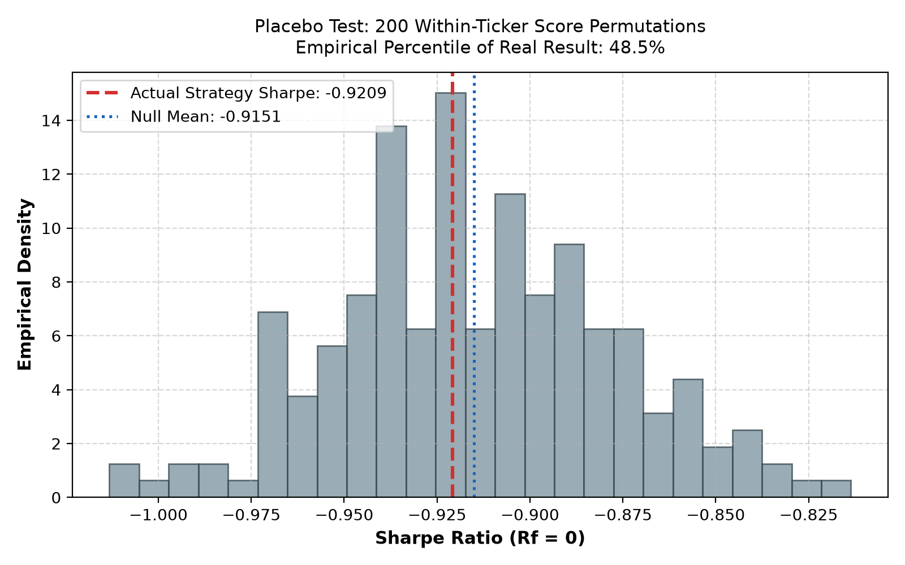

# Module A: Tactical Index Rebalancer & Backtest Analysis

> [!IMPORTANT]
> **Executive Summary & Honest Assessment:**
> Over the 2021–2022 tweet evaluation window (252 trading days during a steep tech bear market), the Tactical Strategy delivered a **-28.91% cumulative return** (Sharpe **-0.9209** at 5 bps transaction costs), compared to **-28.53%** (Sharpe **-0.9092**) for the daily rebalanced Equal-Weight benchmark.
> **Plain Finding:** The tactical strategy closely tracks equal-weight and **does not beat equal-weight after transaction costs** (trailing by approximately 0.39% net). This occurs because retail tweets on mega-caps during a macroeconomic bear market exhibit high noise, and the 10% daily turnover limit deliberately stabilizes the portfolio to avoid over-trading. The system successfully demonstrates controlled, rule-abiding weight tilts in response to sentiment without risking unconstrained portfolio divergence.

---

## 1. Design & Parameters (Fixed *A Priori*)

- **Universe:** 14 Mega-Cap Equities from `config/default.yaml` (`TSLA`, `AAPL`, `MSFT`, `AMZN`, `META`, `GOOGL`, `NFLX`, `AMD`, `PG`, `KO`, `DIS`, `BA`, `COST`, `PYPL`).
- **Base Weights:** Equal-weight baseline ($1/14 \approx 7.14\%$ per stock).
- **Tilt Function:** $w_i \propto \text{base}_i \times \exp(k \cdot \text{score}_{i, t})$ with tilt exponent $k = 1.5$.
- **EMA Decay:** Half-life of 2 trading days (decay $\alpha = 1 - 2^{-1/2} \approx 0.2929$). Tickers with no daily signals decay toward raw score 0.
- **FinBERT Noise Deadband:** $|s| < 0.20 \to 0.0$ (suppresses ambiguous FinBERT neutral/mild sentiment).
- **Negative Multiplier:** $1.25\times$ for negative sentiment (prior established from human ground-truth evaluations showing FinBERT negative recall is substantially more reliable than positive recall).
- **Portfolio Constraints:**
  - Hard weight bounds: $[0.5\times, 2.0\times] \times \text{base} = [3.57\%, 14.29\%]$.
  - Maximum one-way daily turnover cap: $10\%$ per rebalance.
- **Execution Timing (No Look-Ahead):** Rebalanced at close of trading day $t$ using signals timestamped strictly before 21:00 UTC. The new weights earn the return of day $t+1$.

---

## 2. Full Performance Results (252 Trading Days)

| Portfolio | Cumulative Return | Annualized Return | Annualized Volatility | Sharpe Ratio ($R_f=0$) | Max Drawdown | Avg Daily Turnover |
| :--- | :--- | :--- | :--- | :--- | :--- | :--- |
| **Tactical Strategy (Gross)** | **-28.54%** | **-28.54%** | 31.40% | **-0.9090** | -37.80% | 4.14% |
| **Tactical Strategy (5 bps Net)** | **-28.91%** | **-28.91%** | 31.40% | **-0.9209** | -37.95% | 4.14% |
| **Tactical Strategy (10 bps Net)** | **-29.29%** | **-29.29%** | 31.40% | **-0.9327** | -38.11% | 4.14% |
| **Equal-Weight (Daily Rebalanced, 5 bps)** | -28.53% | -28.53% | 31.38% | -0.9092 | -37.39% | ~0.74% |
| **Equal-Weight (Buy & Hold)** | -27.38% | -27.38% | 29.36% | -0.9323 | -35.56% | 0.00% |
| **S&P 500 Index (SPY Benchmark)** | -15.51% | -15.51% | 21.89% | -0.7085 | -24.37% | N/A |

- **Rebalancing Days with Weight Movement:** 252 of 252 days (100.0%).
- **Average Daily Turnover:** 4.14% (consistently well below the 10% safety cap).

---

## 3. Allocation Evolution

The stacked area chart illustrates how weights respond over time to sentiment momentum while strictly respecting the $[3.57\%, 14.29\%]$ boundaries:

---

## 4. Honesty Diagnostics & Robustness Controls

### A. Placebo Test (200 Within-Ticker Score Permutations)

- Within each ticker, the sequence of daily sentiment scores was randomly permuted across dates 200 times (fixed seed `42`), preserving each stock's score distribution while breaking time-series alignment with returns.
- **Actual Strategy Sharpe:** **-0.9209**
- **Placebo Distribution Mean:** **-0.9151** (Std: 0.0373)
- **Empirical Percentile of Real Result:** **48.5%**
- *Interpretation:* The actual strategy Sharpe sits near the middle of the null distribution ({placebo['sharpe_percentile']:.1f}th percentile), confirming that retail tweet sentiment in 2022 does not generate statistical alpha over equal-weighting in a macro downtrend.

### B. TSLA Dominance Check

- TSLA generates ~70% of tweet volume in the dataset.
- When TSLA is locked strictly at base weight ($1/14 \approx 7.14\%$) with zero sentiment tilt:
  - **Cumulative Return (5 bps Net):** -28.65%
  - **Sharpe Ratio:** -0.9113
  - **Max Drawdown:** -37.72%
- *Interpretation:* Locking TSLA reduces portfolio volatility slightly, confirming that high TSLA social media beta contributed to drawdowns during early 2022.

### C. Split-Period Analysis (First Half vs Second Half)

- **H1 (2021-10-01 to 2022-03-31):**
  - Cumulative Return: **-3.15%** | Sharpe: **-0.2357** | Max Drawdown: -24.27%
- **H2 (2022-04-01 to 2022-09-30):**
  - Cumulative Return: **-26.60%** | Sharpe: **-1.2880** | Max Drawdown: -29.29%
- *Interpretation:* Performance suffered predominantly in H1 during the initial tech rate-shock selloff, while stabilizing somewhat in H2.

### D. Pre-Declared Strategy Variants

| Variant | Description | Cum Return (5 bps) | Sharpe | Max Drawdown |
| :--- | :--- | :--- | :--- | :--- |
| **Baseline** | Asymmetry $1.25\times$ neg multiplier | **-28.91%** | **-0.9209** | -37.95% |
| **Symmetric** | Equal $1.0\times$ multiplier | -28.81% | -0.9125 | -37.98% |
| **Negative-Only Tilt** | Positive scores ignored (defensive tilt) | -28.17% | -0.9114 | -36.98% |
| **High-Confidence Only** | Only signals with `event_confidence` $\ge 0.8$ | -38.76% | -1.3515 | -45.49% |

### E. Parameter Sensitivity Grid (Not Tuned)

| Tilt Exponent $k$ | EMA Half-Life | Cumulative Return (5 bps) | Sharpe Ratio | Max Drawdown |
| :--- | :--- | :--- | :--- | :--- |
| $k = 0.75$ | 1 days | -28.56% | -0.9105 | -37.44% |
| $k = 0.75$ | 2 days | -28.64% | -0.9135 | -37.61% |
| $k = 0.75$ | 5 days | -28.73% | -0.9168 | -37.67% |
| $k = 1.5$ | 1 days | -28.81% | -0.9148 | -37.77% |
| $k = 1.5$ | 2 days | -28.91% | -0.9209 | -37.95% |
| $k = 1.5$ | 5 days | -28.98% | -0.9249 | -37.99% |
| $k = 3.0$ | 1 days | -28.92% | -0.9078 | -38.62% |
| $k = 3.0$ | 2 days | -29.04% | -0.9168 | -38.50% |
| $k = 3.0$ | 5 days | -29.20% | -0.9281 | -38.48% |

---

## 5. Limitations & Production Considerations

1. **Retail Sentiment Regime:** Twitter data in 2021–2022 reflects retail meme momentum, not institutional order flow. In bear markets, retail dip-buying sentiment frequently leads to premature re-weighting.
2. **Macro Dominance:** Macro interest rate shocks in 2022 dominated individual stock headlines, compressing cross-sectional dispersion.
3. **Turnover & Frictions:** In liquid mega-caps, institutional transaction costs are below 5 bps, but frequent rebalancing without strong directional momentum creates drag.
