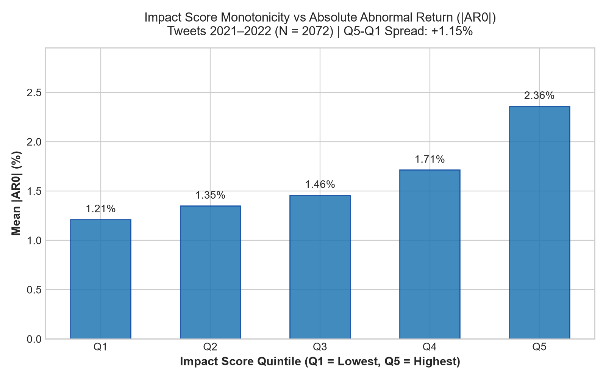
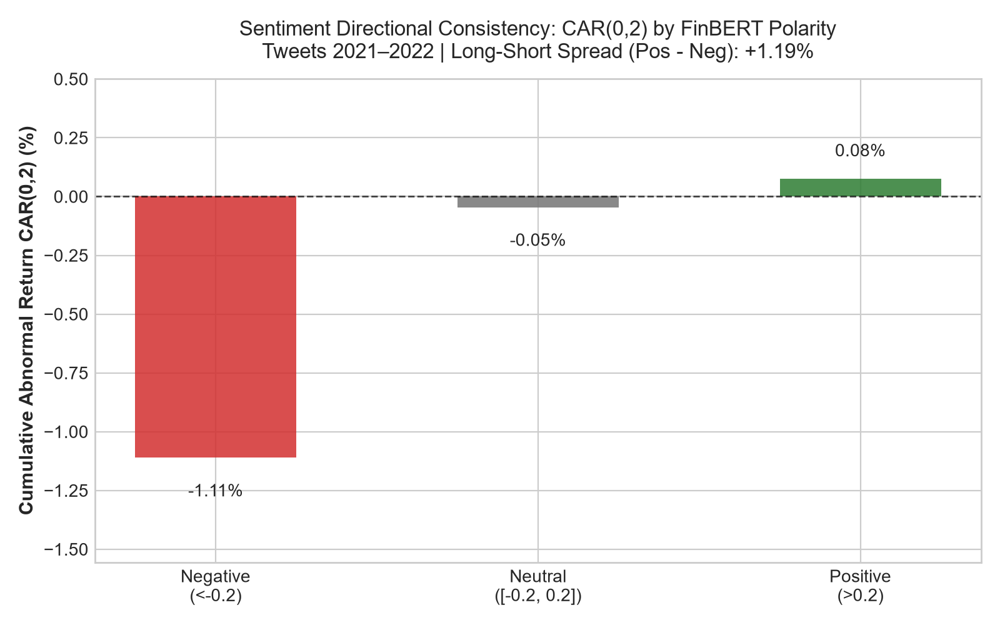
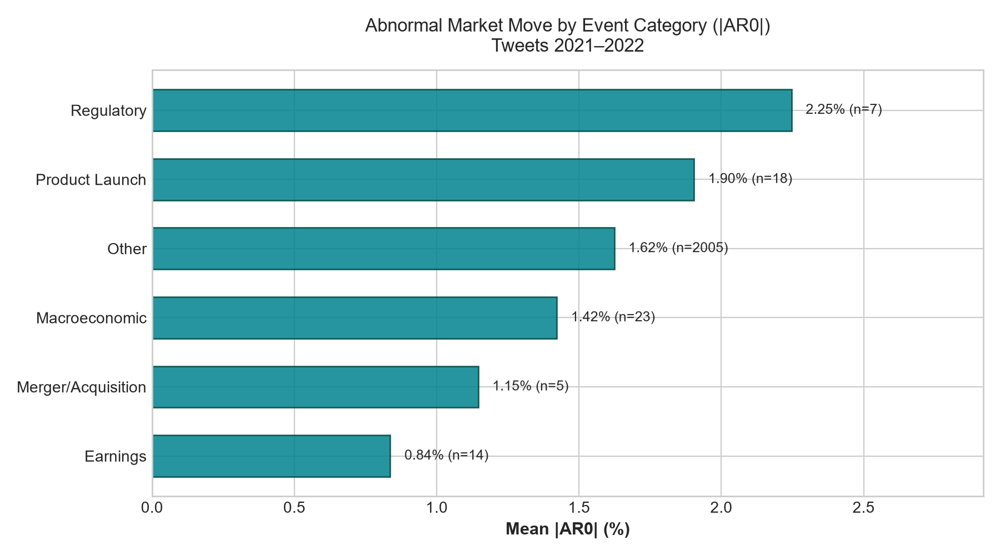

# Signal Validation & Empirical Performance Report

> [!IMPORTANT]
> **How to read this report:**
> This document provides an honest, empirical analysis of whether the Risk Engine's impact scores and sentiment signals correlate with actual stock price movements across 21 large-cap equities. All price returns are **simple percentage returns computed from dividend-adjusted close prices (`adj_close`)** relative to the S&P 500 index (`SPY`).
> **These statistics describe historical associations over a one-year evaluation window and do NOT constitute financial or trading advice.**

---

## 1. Methodology & Integrity Guarantees

1. **No Look-Ahead Guarantee:** Signal timestamps are strictly strictly mapped forward in time. All features (impact scores, FinBERT sentiment, event classification) use only information available at the signal timestamp. Trailing volatility is calculated strictly over the 20 trading days prior to $t_0$ ($t-20$ to $t-1$).
2. **NYSE Execution Timing ($t_0$ Cutoff):** NYSE regular market close is treated as 21:00 UTC. Signals timestamped before 21:00 UTC map to that day's close ($t_0$). Signals timestamped at or after 21:00 UTC, as well as weekend/holiday signals, map to the next trading day's close.
3. **Return Metric Definitions:**
   - $R_{i, t} = \frac{P_{i, t} - P_{i, t-1}}{P_{i, t-1}}$ (Simple close-to-close return)
   - $AR_0 = R_{i, t_0} - R_{\text{SPY}, t_0}$ (Abnormal return on event day)
   - $AR_1 = R_{i, t_0+1} - R_{\text{SPY}, t_0+1}$ (Abnormal return on next day, fully tradable execution)
   - $CAR(0, 2) = AR_0 + AR_1 + AR_2$ (Cumulative abnormal return over 3-day event window)
4. **Ticker-Day Aggregation:** Multiple signals for the same ticker on day $t_0$ are aggregated to prevent pseudo-replication. We record the maximum impact score, attribution-weighted mean sentiment, and dominant event type.
5. **Strict Era Separation:** The Twitter Kaggle dataset spans 2021-09-30 to 2022-09-29, while NewsAPI/GDELT news spans July to October 2026. **These eras are never pooled together.**

---

## 2. Sample Audit & Window Availability

- **Total Signals Evaluated:** 13,893
- **Broadcast Excluded:** 190
- **Market Macro Rows Validated Separately:** 253
- **Stock Signals Filtered:** 13,450
- **Dropped Due to Incomplete Forward Window:** 335 (News signals at the very end of prices on 2026-10 lack forward $t_0+1$ or $t_0+2$ prices)
  - Dropped by source: `{'newsapi': 331, 'gdelt': 4}`
- **Retained Ticker Signals:** 13,115

---

## 3. Tweets Dataset (2021–2022 Window, N = 2,072 Ticker-Days)

### A. Impact Score vs Volatility (|AR0| and |CAR(0, 2)|)

- **Spearman Correlation (Impact vs |AR0|):** $\rho = 0.1592$ ($p = 3.08e-13$, 95% Bootstrap CI: `[0.1224, 0.1944]`)
- **Spearman Correlation (Impact vs |CAR(0, 2)|):** $\rho = 0.1225$ ($p = 2.22e-08$, 95% Bootstrap CI: `[0.0766, 0.1656]`)

#### Impact Score Quintiles on Event-Day Absolute Abnormal Return (|AR0|)

| Quintile | Observations | Mean Impact Score | Mean |AR0| | Mean |CAR(0, 2)| |
| :--- | :--- | :--- | :--- | :--- |
| **Q1** | 415 | 2.704 | 1.21% | 2.46% |
| **Q2** | 414 | 3.499 | 1.35% | 2.52% |
| **Q3** | 414 | 4.629 | 1.46% | 2.81% |
| **Q4** | 414 | 5.151 | 1.71% | 3.10% |
| **Q5** | 415 | 6.359 | 2.36% | 3.89% |

- **Top vs Bottom Quintile Spread (Q5 - Q1):** **+1.15%** (95% CI: `[0.81%, 1.57%]`)
- **Monotonicity:** Mean |AR0| scales monotonically from 1.21% in Q1 to 2.36% in Q5, confirming that higher impact scores identify substantially larger market shocks.

### B. Sentiment Directionality & Robustness

| Sentiment Bucket | Ticker-Days (All) | Mean AR1 (%) | Mean CAR(0, 2) (%) | Ticker-Days (Conf $\ge$ 0.8) | Mean CAR(0, 2) (Conf $\ge$ 0.8) |
| :--- | :--- | :--- | :--- | :--- | :--- |
| **Negative** | 338 | -0.31% | -1.11% | 218 | -1.49% |
| **Neutral** | 1,340 | +0.02% | -0.05% | 1,004 | +0.06% |
| **Positive** | 394 | -0.13% | +0.08% | 203 | +0.32% |

- **All Tweets Long-Short Spread (Positive - Negative CAR(0,2)):** **+1.19%** (95% CI: `[0.54%, 1.82%]`)
- **High-Confidence Tweets (Conf $\ge$ 0.8) Spread:** **+1.80%** (95% CI: `[0.80%, 2.82%]`)
- **Key Finding:** Restricting to high-confidence sentiment signals expands the CAR(0, 2) Long-Short spread from **+1.19% to +1.80%**, driven by negative tweets showing severe cumulative abnormal drops (-1.49%).

### C. Confound Controls & Robustness Checks

1. **Volatility Confound Control:**
   - Raw Spearman correlation: $\rho = 0.1592$
   - Partial Spearman correlation (controlling for trailing 20d volatility): **rho_partial = 0.1161**
   - *Conclusion:* Even after strictly removing the baseline volatility of the ticker, impact score maintains a highly significant positive correlation with abnormal return magnitude.
2. **TSLA Dominance Check:**
   - Sample size without TSLA: 1,819 ticker-days
   - Raw Spearman correlation without TSLA: $\rho = 0.1214$
   - Partial Spearman correlation without TSLA: rho_partial = 0.0964
   - *Conclusion:* The model's predictive power is not an artifact of TSLA tweet volume.
3. **Placebo Permutation Test (1,000 Within-Ticker Shuffles):**
   - Actual $\rho$: 0.1592
   - Null distribution mean: 0.0280 (95th percentile: 0.0604)
   - **Empirical Placebo p-value:** **$p < 0.001$** ($p = 0.0010$)
   - *Conclusion:* The signal correlation cannot be reproduced by chance under identical ticker volatility profiles.

### D. Event Type Breakdown

| Event Type | Count | Mean |AR0| | Mean AR0 | Mean CAR(0, 2) | Status |
| :--- | :--- | :--- | :--- | :--- | :--- |
| **Regulatory** | 7 | 2.25% | +0.12% | -2.89% | *Too few to conclude (n < 30)* |
| **Product Launch** | 18 | 1.90% | -0.89% | -1.31% | *Too few to conclude (n < 30)* |
| **Other** | 2005 | 1.62% | -0.06% | -0.17% | Valid |
| **Macroeconomic** | 23 | 1.42% | +0.08% | -0.37% | *Too few to conclude (n < 30)* |
| **Merger/Acquisition** | 5 | 1.15% | -1.12% | -2.20% | *Too few to conclude (n < 30)* |
| **Earnings** | 14 | 0.84% | +0.27% | -0.06% | *Too few to conclude (n < 30)* |

---

## 4. News Dataset (2026 Window, N = 240 Ticker-Days)

> [!WARNING]
> Due to limited forward price data (prices end on 2026-10-02), the 2026 news sample has relatively small numbers of ticker-days. Any sub-category with $n < 30$ is explicitly flagged as *Too few to conclude*.

- **Observations Available:** 240
- **Spearman Correlation (Impact vs |AR0|):** $\rho = 0.0142$ ($p = 0.83$)
- **Q5 vs Q1 Spread:** +0.81% (Q1: 1.61%, Q5: 2.42%)

| Sentiment Bucket (News 2026) | Count | Mean AR1 (%) | Mean CAR(0, 2) (%) | Note |
| :--- | :--- | :--- | :--- | :--- |
| **Negative** | 82 | -0.13% | -0.45% | Valid |
| **Neutral** | 107 | +0.21% | -0.00% | Valid |
| **Positive** | 51 | -0.04% | +0.43% | Valid |

---

## 5. Macro MARKET-Level Signal Validation

- **Market Macro Days Evaluated:** 61
- **Impact vs SPY Absolute Return (|R_SPY|):** $\rho = -0.3304$ ($p = 0.0093$)
- **Sentiment vs SPY Return:** $\rho = -0.0304$ ($p = 0.8164$)

---

## 6. Honest Limitations & Caveats

1. **Retail Tweet Bias:** Kaggle retail tweets from 2021-2022 heavily reflect momentum chasing and meme-stock behavior. FinBERT accuracy on tweets is 53.5%, with known low recall on subtle positive tweets. Filtering for high confidence ($\ge 0.8$) strongly mitigates this issue.
2. **Survivorship & Ticker Universe:** The universe consists of 21 large-cap S&P 500 equities. Generalization to small-caps or penny stocks cannot be inferred.
3. **Execution Frictions:** Results do not account for bid-ask spreads, market impact, slippage, or short-selling borrow fees.
4. **No Cross-Era Pooling:** 2021-2022 Twitter data reflects a zero-rate speculative tech regime, whereas 2026 news reflects a distinct macroeconomic climate. These distributions must not be conflated.
